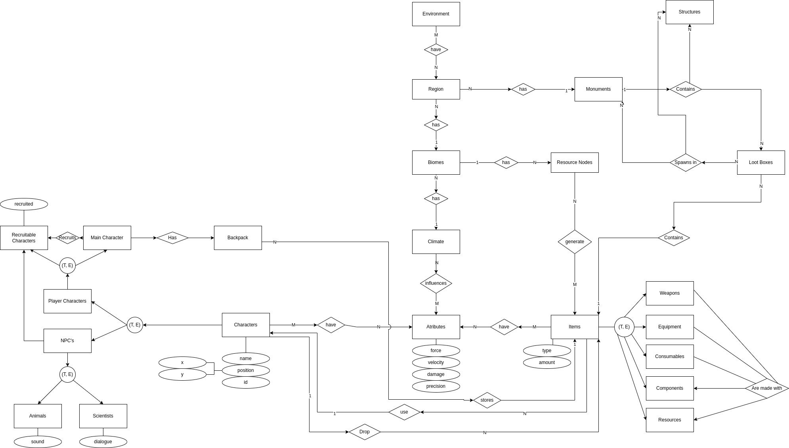

# Rust - Grupo 09

**Disciplina**: Sistema de Banco de Dados 1 
**Código da Disciplina**: FGA0137 

## Alunos
|Matrícula | Aluno | GitHub |
| -- | -- | -- |
| 16/0124735 | Iago Oliveira | [@iagoomr](https://github.com/iagoomr) |
| 18/0145088 | Gabriel Bonifácio Perez Nunes | [@gabrielbpn](https://github.com/gabrielbpn) |
| 16/0037522 | Nilo Mendonça de Brito Júnior | [@NiloMendonca](https://github.com/NiloMendonca) |
| 16/0038090 | Pedro Daniel Carvalho Matias | [@pdaniel37](https://github.com/pdaniel37) |
| 15/0149948 | Thiago Ferreira | [@thiagoiferreira](https://github.com/thiagoiferreira) |

## Sobre

&nbsp;&nbsp;Repositório direcionado para o desenvolvimento do projeto do Grupo 09 na disciplina SBD1 com o professor Maurício Serrano. O projeto visa o desenvolvimento de um jogo de Rust no estilo MUD (Multi-user dungeon).

  

## Módulo 1 - Modelo Entidade Relacionamento

&nbsp;&nbsp;O Modelo Entidade Relacionamento, se caracteriza como um modelo conceitual utilizado na Engenharia de Software que busca descrever as entidades (objetos) envolvidas em um domínio de negócios, com seus atributos (características) e como elas se relacionam entre si (relacionamentos). Representando de forma abstrata a estrutura que possuirá o  banco de dados da aplicação.

### Diagrama

  

