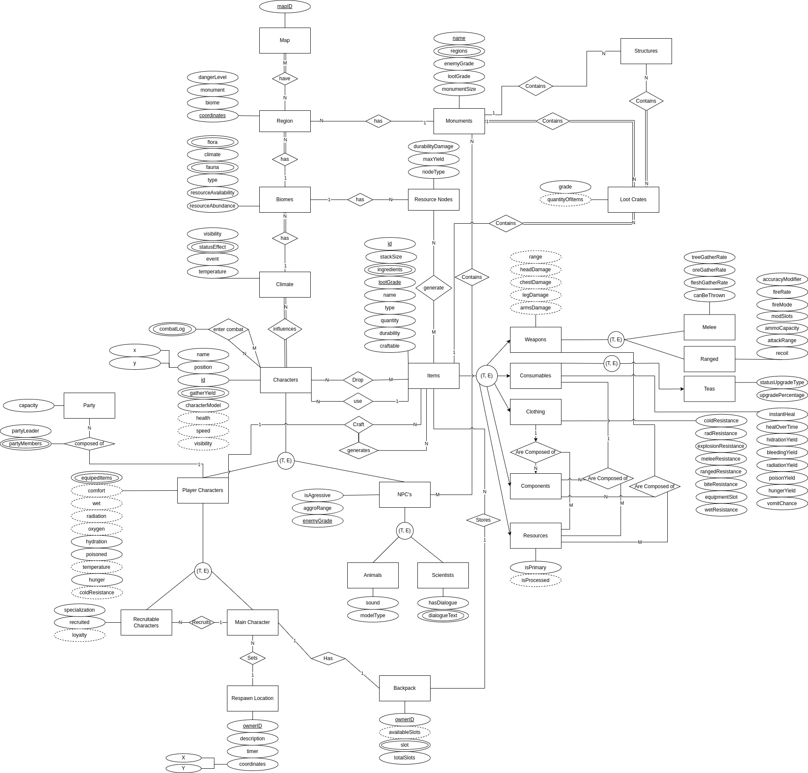

# Rust - Grupo 09

**Disciplina**: Sistema de Banco de Dados 1 
**Código da Disciplina**: FGA0137 

## Alunos
|Matrícula | Aluno | GitHub |
| -- | -- | -- |
| 16/0124735 | Iago Oliveira | [@iagoomr](https://github.com/iagoomr) |
| 18/0145088 | Gabriel Bonifácio Perez Nunes | [@gabrielbpn](https://github.com/gabrielbpn) |
| 16/0037522 | Nilo Mendonça de Brito Júnior | [@NiloMendonca](https://github.com/NiloMendonca) |
| 16/0038090 | Pedro Daniel Carvalho Matias | [@pdaniel37](https://github.com/pdaniel37) |
| 15/0149948 | Thiago Ferreira | [@thiagoiferreira](https://github.com/thiagoiferreira) |

## Sobre

&nbsp;&nbsp;Repositório direcionado para o desenvolvimento do projeto do Grupo 09 na disciplina SBD1 com o professor Maurício Serrano. O projeto visa o desenvolvimento de um jogo de Rust no estilo MUD (Multi-user dungeon).

  

## Módulo 1 - Modelo Entidade Relacionamento

&nbsp;&nbsp;O Modelo Entidade Relacionamento, se caracteriza como um modelo conceitual utilizado na Engenharia de Software que busca descrever as entidades (objetos) envolvidas em um domínio de negócios, com seus atributos (características) e como elas se relacionam entre si (relacionamentos). Representando de forma abstrata a estrutura que possuirá o  banco de dados da aplicação.

### Diagrama

  

## Módulo 2 - Modelo Relacional

&nbsp;&nbsp;O modelo relacional é um modelo de dados representativo, que se baseia no princípio de que todos os dados estão armazenados em relações (tabelas). Toda sua definição é teórica e baseada na lógica de predicados e na teoria dos conjuntos.

### Representação
Map = { <u>mapID</u> }

HaveMapRegion = { <u>mapID</u>, <u>coordinates</u> }

Region = { <u>coordinates</u>*¹, biome, monument, dangerLevel, monument*¹º }

Biomes = { <u>biomesID</u>*², coordinates*¹, resourceAbundance, resourceAvailability, type, climate*³ }

Flora = { biomes*², <u>flora</u> }

Fauna = { biomes*², <u>fauna</u> }

Climate = { <u>climateID</u>*³, temperature, event, statusEffect, visibility }

Characters = { <u>charactersID</u>*⁴, name, position, characterModel, climate*³, type, item }

GatherYield = { <u>character</u>*⁴, <u>gatherYield</u> }

EnterCombatCharacters = { <u>enterCombatCharactersID</u>*⁵, firstCharacter*⁴, secondCharacter*⁴ }

CombatLog = { <u>enterCombatCharacters</u>*⁵, indexLog, log }

PlayerCharacters = { <u>charactersID</u>*⁴, hydration, poisoned, hunger, type, equipedItems1, equipedItems2, equipedItems3, equipedItems4, equipedItems5, backpack*¹³ }

RecruitableCharacters = { <u>charactersID</u>*⁴, specialization, recruited }

MainCharacter = { <u>charactersID</u>*⁴, owner*⁶ }

RespawmLocation = { <u>ownerID</u>*⁶, description, timer, X, Y }

NPCs = { <u>charactersID</u>*⁴, isAgressive, aggroRange, enemyGrade, type }

Animals = { <u>charactersID</u>*⁴, sound, modelType }

Scientists = { <u>charactersID</u>*⁴, hasDialogue }

DialogueText = { character*⁴, <u>dialogue</u> }

Items = { <u>itemsID</u>*⁷, stackSize, <u>lootGrade</u>*⁸, name, type, quantity, durability, craftable, type, backpack*¹³, character*⁴ }

Ingredients = { items*⁷, lootGrade*⁸, <u>ingredient</u> }

DropCharactersItems = { <u>dropCharactersItemsID</u>, item*⁷, lootGrade*⁸, character*⁴ }

PlayerCharactersGeneratesItem = { <u>character</u>*⁴, <u>items</u>*⁷ }

Weapons = { <u>itemsID</u>*⁷, type }

Melee = { <u>itemsID</u>*⁷, canBeThrown, fleshGatherRate, oreGatherRate, treeGatherRate }

Ranged = { <u>itemsID</u>*⁷. recoil, attackRange, amnoCapacity, modSlots, fireMode, fireRate, accuracyModifier }

Consumables = { <u>itemsID</u>*⁷, instantHeal, healOverTime, hidrationYield, bleedingYield, radiationYield, poisonYield, hungerYield, hungerYield, vomitChance, type }

Teas = { <u>itemsID</u>*⁷, statusUpgradeType, upgradePercentage }

Clothing = { <u>itemsID</u>*⁷, coldResistance, radResistance, explosionResistance, meleeResistance, rangedResistance, biteResistance, equipmentSlot, wetResistance }

Components = { <u>itemsID</u>*⁷ }

Resources = { <u>itemsID</u>*⁷, isPrimary }

WeaponsAreComposedOfComponentsResources = { weapons*⁷, <u>components</u>*⁷, <u>resouces</u>*⁷ }

ConsumablesAreComposedOfComponentsResources = { consumables*⁷, <u>components</u>*⁷, <u>resouces</u>*⁷ }

ClothingAreComposedOfComponentsResources = { clothing*⁷, <u>components</u>*⁷, <u>resouces</u>*⁷ }

ResourceNodes = { <u>resourceNodesID</u>*⁹, nodeType, maxYield, durabilityDamage, biomes*² }

ResourceNodesGenerateItems = { <u>resourceNodes</u>*⁹, <u>item</u>*⁷ }

Monuments = { <u>name</u>*¹º, monumentSize, lootGrade, enemyGrade }

regionsMonuments = { <u>name</u>*¹º, <u>regionMonument</u> }

Structures = { <u>structureID</u>*¹¹ , monument*¹º }

LootCrates = { <u>lootCratesID</u>*¹², grade }

StructuresContainsLootCrates = { <u>structure</u>*¹¹, <u>lootCrates</u>*¹² }

Party = { <u>partyID</u>, character*⁴, capacity } 

Backpack = { <u>ownerID</u>*¹³, slot1, slot2, slot3, slot4, slot5, totalSlots }
